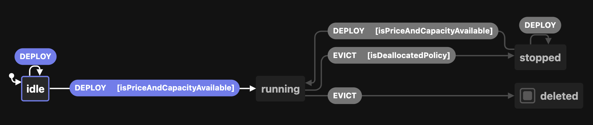
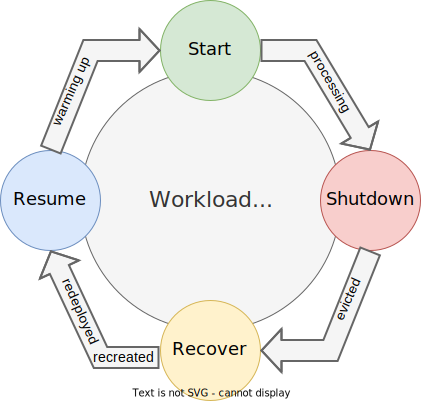

# Interruptible workloads on Azure Spot VM/VMSS instances

## Introduction

This reference implementation provides you with a workload that is meant to guide you to explore the Azure Spot VM manage service from a development and architectural perspective to get the fundamentals, and most of the moving parts so you feel comfortable while building your own workload as a next step. As an application architect, you will know how to design a solution to support interruptions. As a developer, you want to use this workload example to reference when writing code.

Azure as major cloud must provision spare capacity along all its offered regions so it can respond on demand when new resources are created. Meanwhile that capacity remains idle, you are given with the chance to [oportuniscally deploy that compute in your subscription at discount prices and capped at **Pay as you go** prices using Azure Spot VM/VMSS](https://azure.microsoft.com/pricing/spot-advisor/).

As a general thought, keeping the OpEx under control is a predominant practice when running solutions on the cloud, and [the cost optimizations pillar from the Well Architected Framework](https://docs.microsoft.com/azure/architecture/framework/cost/overview) can further assist you finding the right strategy for your architecture. While the number one motivation to choose using Azure Spot VM/VMSS instances is significant cost savings at the infrastructure level, you have to keep in mind that you need to build reliable interruptible workloads that can run on top of this Azure managed service.

In the era of Distributed Systems, a technique that gained popularity is the Chaos Engineering that consist of introducing detrimental conditions without previous notice to experiment with workloads running peacefully in production. This helps to test their fault tolerance and resilence with the main objective of detecting the workloads that can withstand operating normally and those that need to be improved to work properly under unfavorable circumstances. As described above Azure Spot VM/VMSS is not designed to cause breakdowns, and yet you will find that the same system properties are suitable when building applications that can run efficiently on top of this Azure service.

Therefore, workloads will have the requirement to be designed fault tolerant and resilient, so they should be capable of being unexpectedly and reliable interrupted. Typically, such workloads are able to deal with high levels of uncertainty at the time of being deployed, and can recover after being forcedly shutdown or even better they can gracefully shutdown under 30 sec notification prior to eviction.

Some good candidates to run on top of Azure Spot VM are batch processing apps, workloads that are not time critical for background processing jobs, as well as those large enough as in data analytics but that you don’t care if they really finish in a certain period of time, tasks consired as optional or with lower priority such us spawning a CI/CD agent for a dev/test environment, short lived jobs that can lose its progress without affecting the end result as many times as evicted until completion. Some orgnizations might categorize long running process when they are time constrained to units like "weeks" or even "months", as an application architect you might want to team up with your business orgnization to discover your own long runnings. Azure Virtual Machine Scalsets (VMSS) is also offered with priority **Spot**, and it is an underlaying service that will represent nodes for a Azure Kubernetes Service (AKS) cluster. As a result, stateless applications as well as opportunistic scale out scearios are also possible candidates to be build with Azure Spot VMSS in mind if they are meant to run from an AKS cluster. This later use case is out of scope in this reference implementation. As general guidance, you should consider avoid using Azure Spot VM/VMSS if your application is under a strict SLA that could be compromised by compute eventual interruptions, if your are planning to provision sticky session solutions or provided your workload is not designed to be interrupted, or it is stateful by nature. In `production` it is recommended to keep a guaranteed amount of Azure VM instances with **Regular Priority** to be safely compliance with your application SLA in addition to some amount configured with **Spot priority** for cost optimization purposes. If workload is so interruptable that it doesn't need an SLA, you might consider going over full **Spot Priority** even in `production`.

In a nutshell, Azure Spot VM/VMSS are compute Infrastructure as a Service available in Azure that serves without a SLA once created, which means that it can be terminated at any moment with up to 30 secs notification. In other words, at any point in time when Azure needs the capacity back, the Azure infrastructure will evict the service by deallocating or deleting the resources based on your configured Eviction policy.

You are acquiring unused (if any) ephemeral compute capacity that offers no high availability guarantees. Given that, Azure Spot VM/VMSS is a limited resource that won’t be always at your disposal.

From the aforementioned concepts, you could model this Azure service as a machine that will change its state depending on users input or events triggered by the Azure infrastructure. If this idea gets a bit more generalized, you will recognize this as a kind of finite-state machine. You may find valuable this infrastructure thinking to properly design workloads capable of adjusting to different conditions they might run into Azure Spot VM/VMSS.

The Azure Spot VM/VMSS instances while be transitioning one of the following valid states at the time, and your workload has to be able to behave accordingly on top of:
1. Stopped or Deleted (eviction policy based)
1. Running (based on capacity and max price you set)

| Current State  | Input   | Conditions                                                                     | Next State | Output                                                                                                               |
|----------------|---------|------------------------------------------------------------------------------- |------------|----------------------------------------------------------------------------------------------------------------------|
| *              | Deploy  | Max Price >= Current Price and Capacity = Available                            | Running    | You pay the Max Price you set and underlaying disks                                                                  |
| Running        | Evict   | Max Price =  -1            and Capacity = Available                            | Running    | You pay the VM Price and underlaying disks                                                                           |
| Running        | Evict   |                                Capacity = Unavailable and Policy = Deallocate  | Stoped     | Compute capacity gets deallocated while you pay for underlaying disk. It is possible to restart the machine          |
| Running        | Evict   |                                Capacity = Unavailable and Policy = Delete      | Deleted    | You are not charged at this point since disks are deleted                                                            |
| Running        | Evict   | Max Price <  Current Price                            and Policy = Deallocate  | Stoped     | You pay for underlaying disk and can restart the machine                                                             |
| Running        | Evict   | Max Price <  Current Price                            and Policy = Delete      | Delete     | You are not charged at this point since disks are deleted                                                            |
| Stoped         | Restart | Max Price <  Current Price                            and Policy = Deallocate  | Stoped     | You pay for underlaying disk and can restart the machine                                                             |
| Stoped         | Restart | Max Price <  Current Price                            and Policy = Delete      | Delete     | You are not charged at this point since disks are deleted                                                            |
| Stoped         | Restart | Max Price >= Current Price and Capacity = Available                            | Running    | You pay the Max Price you set and underlaying disks                                                                  |

> **Note**
> It is paramount to understand that under a constraint capacity event from a particular location, and/or provided the current market prices surpass the Max Price you set, the Azure infrastructure will collect its compute capacity for Azure Spot VM following your configured Eviction policy as mentioned above. If you configured your Azure Spot VM for deallocation under an eviction event, it is responsibility of the application operator (automated or manually) to restart the Azure Spot VM once the capacity becomes available.

## Concepts

Some important concepts when building on top of Azure Spot VM instances are:

1. Subscription Limits: 20 cores per subscription by default. Some Subscriptions are not supported (please take a look at the list of supported supported types).
1. Eviction:
   1. Rate: it is nothing but the chances of being evicted at a specific location. A common practice is to choose the location based on the eviction rate by SKU querying the pricing history view from Azure Portal in addition to [Azure Spot VM advisor](https://azure.microsoft.com/pricing/spot-advisor/).
   1.	Type: you can choose between **Max Price or Capacity** or **Capacity Only**
   		1. Capacity: when using Azure Spot Virtual Machine Scalesets (VMSS) with **Manual** scaling, a good practice is to enable the **Try to Restore** option if your policy eviction is **Deallocate**. Provided Azure infrastructure collected capacity back, this configuration looks for those clusters that has the most spare capacity, and will attempt to reploy your deallocated instances on top of them. Therefore, it provides your Azure Spot VMSS with better surviving chances next time an eviction event kicks in. When configured with **Autoscale**, this option is not avaialble as this implements its own logic to reallocate instances.
   			 1. VM Configuration: as flexible as choosing the SKU, the better are chances to be allocate Azure Spot VM/VMSS. Some SKU(s) like B-series or Promo versions of any size are not supported.
   			 1. Location: same as in SKU, if your workload can run from any region, it improves the chances to be deployed as well as with less chances of being deallocated if you choose carefully considering the eviction rates. Please take into account that Microsoft Azure China 21Vianet is not supported.
   			 1. Time of the Day, Weekends, Seasons (i.e. Christmas), and other time based considerations are important factors when making a final decision between Azure Spot over regular VMs/VMSS.
   		1. Current VM Price vs Max Price (you set): if you are willing to pay up to the **Pay as you go** rate, it is possible to prevent from being evicted based on price reasons by setting the your **Max Price** to `-1` wich is known as **Eviction Type Capacity Only**. If pricing is a constraint for your business organization goals, **Eviction Type Max Price or Capacity Only** is recommended for you, and in this case you can adjust the right **Max Price** at any moment by taking into account that changing this value requires to deallocate the VM/VMSS first to take effect. If you choose the later, it is good idea to analyze the price history and **Eviction Rate** for the regions you are targeting to.
   	1. Policy:
   		 1. Delete
   		  	1. You free up the Cores from your Subscription, so shared subscriptions or multiple workloads using Azure Spot VM instances can be befitted from this.
   		  	1. You are not longer charged for the disk as they get deleted along with the Azure Spot VM
   		 1. Deallocate
   		  	1. Change VM state to the stopped-deallocated state
   		  	1. Allowing you to redeploy it later.
   		  	1. You are still being charge for the underlaying disks
   		  	1. It consumes Cores quota from your Subscription
   	1. Simulation: you can [similate an eviction event](https://docs.microsoft.com/azure/virtual-machines/spot-portal#simulate-an-eviction) when Azure needs the capacity back
1. Events: [Azure Scheduled Events](https://docs.microsoft.com/en-us/azure/virtual-machines/linux/scheduled-events) is a metadata service in Azure that signal about forthcoming events associated to the Virtual Machine resource type. The general recommendation when using Virtual Machines is to routinely query this endpoint to discover when maintenance will occur, so you are given the opportunity to prepare for disruption. One of the platform event types being scheduled that you will want to notice is `Preempt` as this signals the imminent eviction of your spot instance. This event is scheduled with a minimum amount of time of 30 seconds in the future. Given that, you must assumme that you are going to have less than that amount of time to limit the impact. The recommended practice in here is to check this endpoint based on the periodicity your workload mandates (i.e. every 10 seconds) to attempt having a gracefully interruption.
1. Metadata Apis: [Azure retail prices API](https://docs.microsoft.com/en-us/rest/api/cost-management/retail-prices/azure-retail-prices).

## The Workload

### Planning for being Fault Tolerant

When building reliable interruptible workloads, you will be focused on four main stages during their lifecycle that will derive into changes of states within your application:

1. Start: after the application `warmup` state is completed, you could consider internally transitioning into `processing` state. An important aspect to contemplate is a previous forced shutdown having as side effect some incomplete processing, so the recommendation is to implement idempotency when applicable. Additionally, it is a good practice to save the context by creating checkpoints regularly. This enables a more efficient recovery strategy which is recover from the latest well-known checkpoint instead of starting all over the processing again.
1. Shutdown: your workload is in `processing` state, and at the same time an eviction event is triggered by the Azure infrastructure. Compute capacity must be collected from Azure Spot instances, and as a result an eviction notice will take place in your application. It is time for your application to change the state to `evicted`, and implement the logic to respond by gracefully shutting down within 30 secs by releasing resources such us draining connections, event logging, or prepare to be forcedly deallocated or deleted based on your **Evition Policy**. In the later configuration, as a general practice you can not persist any progress or data on the file system since disks are being removed along with the Azure VM.
1. Recover: as part of this stage, your workload is `redeployed` or `recreated` depending on your **Eviction Policy** preference. These possible states during a recovery are dectected. You implement the logic to deal with a prior forced shutdown so it is capable of recovering from a previous backup/checkpoint if neeeded.
1. Resume: the application is about to continue processing after a best effort to recover the context prior to eviction. It is good idea to transition into `warmup` state to ensure the workload is healthy and ready to start.

> **Note**
> The aforementioned states are just a reduced list of possible valid conditions for an reliable interruptible workload. You might find others that are convenient for your own workloads.
