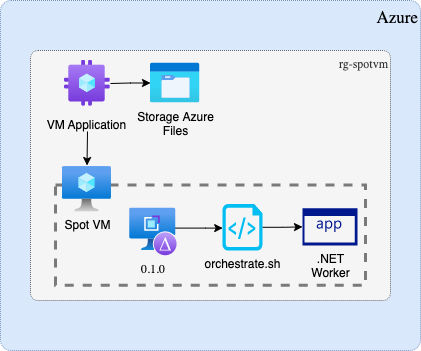
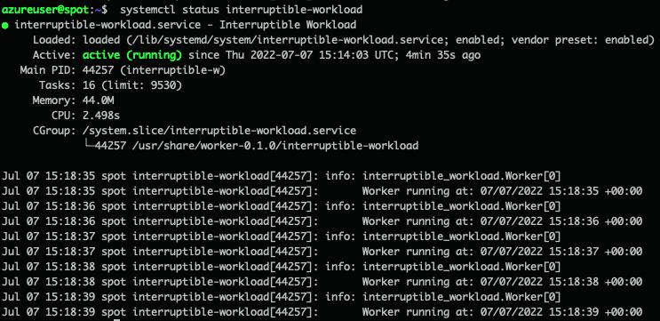

# Interruptible workloads on Azure Spot VM instances

This reference implementation provides you with a workload that is meant to guide you to explore the Azure Spot VM manage service from a development and architectural perspective to get the fundamentals, and most of the moving parts so you feel comfortable while building your own workload as a next step. As an application architect, you will know how to design a solution to support interruptions. As a developer, you want to use this workload example to reference when writing code.

## Azure Architecture Center guidance

This project has a companion article that describe challenges, design patterns, and best practices for Azure Spot VM. You can find this article on the Azure Architecture Center at [Interruptible workloads using Azure Spot VM](https://aka.ms/architecture/interruptible-workloads). If you haven't reviewed it, we suggest you read it as it will give added context to the considerations applied in this implementation. Ultimately, this is the direct implementation of that specific architectural guidance.

## Architecture

Azure must provision spare capacity along all its regions so it can respond on demand when new resources are created. Meanwhile that capacity remains idle, you are given with the chance to oportuniscally deploy on top of [that ephemeral compute in your subscription at discount prices and capped at **Pay as you go** prices using Azure Spot VM/VMSS](https://azure.microsoft.com/pricing/spot-advisor/).

While Azure Spot VM represents a great opportunity for having signicant cost savings, this compute Infrastructure as a Service serves without a SLA once created. In other words, Azure infrastructure could evict Virtual Machines with Spot priority at any point in time even right after the machine has started. Therefore, designing workloads for being realiable interruptible is paramount for running on top of this Azure Spot VM.

In this reference implementation, you are building an interruptible workload, to be deployed on a single Azure Spot VM. This workload will be unexpectedly disrupted by simulating eviction events, and reliable responding upon that.


## Installation

This reference implementation contains a simple and asyncronously queue-processing worker (C#, .NET 6) implemented in combination with [Azure Queue Storage](https://docs.microsoft.com/azure/storage/queues/storage-queues-introduction) and demostrate how to query the [Azure Scheduled Events] REST endpoint that allows the workload to be signaled prior to eviction so it can anticipate such disruption event and prepare for interruption limiting its impact.

This interruptible workload is installed on Azure Spot VM by using VM applicatioons.



### Prerequisites

1. An Azure subscription. You can [open an account for free](https://azure.microsoft.com/free).
1. [Azure CLI installed](https://docs.microsoft.com/cli/azure/install-azure-cli?view=azure-cli-latest) or you can perform this from Azure Cloud Shell by clicking below.

   ```bash
   az login
   ```

1. Ensure you have latest version

   ```bash
   az upgrade
   ```

   [](https://shell.azure.com)

1. [.NET 6.0 SDK](https://dotnet.microsoft.com/download/dotnet/6.0)

1. (Optional | Local Development) [Docker](https://docs.docker.com/)

1. (Optional | Local Development) [OpenSSL](https://www.openssl.org/)

1. (Optional) [JQ](https://stedolan.github.io/jq/download/)

> **Note**
> :bulb: The steps shown here and elsewhere in the reference implementation use Bash shell commands. On Windows, you can [install Windows Subsystem for Linux](https://docs.microsoft.com/windows/wsl/install#install) to run Bash by entering the following command in PowerShell or Windows Command Prompt and then restarting your machine: `wsl --install`

### Planning

At this point, you have learnt that as an Architect you are tasked at being flexile which could be translated into look for as many options as you can find that align well with your organization business goals in terms of budget while at the same time this selection meet the non-functional requirements at the capacity level for your workload.

1. Get acquiented with the VM sizes Azure can offer you, and try to pick out some of them. The following command list VM Skus in `US East 2` that has a number of cores not greather than `8` by excluding from the results not supported options when using Azure Spot VM/VMSS instances:

   > **Note**
   > :bulb: In the future when creating your own interruptible workload ensure you right size your compute requirements, and include the filters in the following query or consider using the [Virtual machine selector tool](https://azure.microsoft.com/pricing/vm-selector/).

   ```bash
   az vm list-sizes -l eastus2 --query "sort_by([?numberOfCores <=\`8\` && contains(name,'Standard_B') == \`false\` && contains(name,'_Promo') == \`false\`].{Name:name, Cores:numberOfCores, RamMB:memoryInMb, DiskSizeMB:resourceDiskSizeInMb}, &Cores)" --output table
   ```

   The command above display an output similar to the following:

   ```output
   Name                  Cores    RamMB    DiskSizeMB
   --------------------  -------  -------  ------------
   Standard_D1_v2        1        3584     51200
   Standard_F1           1        2048     16384
   ...
   Standard_D2_v2        2        7168     102400
   Standard_D11_v2       2        14336    102400
   ...
   Standard_D12_v2       4        28672    204800
   Standard_F4           4        8192     65536
   ...
   Standard_NC6s_v3      6        114688   344064
   Standard_NV6          6        57344    389120
   ...
   Standard_E8as_v4      8        65536    131072
   Standard_D4           8        28672    409600
   ...
   ```

1. Before laying out an infrastructure proposal, you have to be aware about pricing. You can navigate to the [Azure Spot advisor] to contrast alternatives you have found from the previous step to apply another fitler more budget related for a final cherry-pick. Alternatively, if you had installed JQ you could execute the following command:

   ```bash
   curl -X GET 'https://prices.azure.com/api/retail/prices?api-version=2021-10-01-preview&$filter=serviceName%20eq%20%27Virtual%20Machines%27%20and%20priceType%20eq%20%27Consumption%27%20and%20armRegionName%20eq%20%27eastus2%27%20and%20contains(productName,%20%27Linux%27)%20and%20contains(skuName,%20%27Low%20Priority%27)%20eq%20false' --header 'Content-Type: application/json' --header 'Accept: application/json' | jq -r '.Items | sort_by(.skuName) | group_by(.armSkuName) | [["Sku Retail[$/Hour] Spot[$/Hour] Savings[%]"]] + [["-------------------- ------------ ------------ ------------"]] + map([.[0].armSkuName, .[0].retailPrice, .[1].retailPrice, (100-(100*(.[1].retailPrice / .[0].retailPrice)))]) | .[] | @tsv' | column -t
   ```

   > **Note**
   > :bulb: You could modify this query by changing the filter for example to incorporte the VM sizes you are mostly interested in as well as specific regions.

   You should get an output similar as shown below:

   ```output
   Sku                        Retail[$/Hour]  Spot[$/Hour]  Savings[%]
   --------------------       ------------    ------------  ------------
   Standard_DC16ds_v3         1.808           0.7232        60
   Standard_DC16s_v3          1.536           0.6144        60
   Standard_DC1ds_v3          0.113           0.0452        60
   ...
   Standard_NC48ads_A100_v4   7.346           2.9384        60
   Standard_NC96ads_A100_v4   14.692          5.8768        60
   Standard_ND96amsr_A100_v4  32.77           16.385        50
   ```

   > **Note**
   > :bulb: Provided you have choosen a **Max Price and Capacity** eviction policy, it is a good practice to regularly use the [Azure Retail Prices API] to check whether the **Max Price** you set is doing well against  **Current Price**. You might want to consider scheduling this query and respond with **Max Price** changes as well as gracefully deallocate the Virtual Machine accordingly.

### Expected Results

Following the steps below will result in the creation of the following Azure resources that will be used throughout this Reference Implementation.

| Object                                    | Purpose                                                                                                                                                                                                                                                                          |
|-------------------------------------------|----------------------------------------------------------------------------------------------------------------------------------------------------------------------------------------------------------------------------------------------------------------------------------|
| A Resource Group                          | Contains all of your organization's related networking, and copmute resources.                                                                                                                                                                                                   |
| A single Azure Spot VM instance           | Based on how flexible you can be you selected an Azure VM size, and it gets deployed so your interruptible workloads can be installed and executed from there. In this Reference Implementation, the `Standard_D2s_v3` size was chosen and the VM is assigned a System Managed Identity to give it Azure RBAC permissions as a Storage Queue Consumer. |
| A Storage Account (blob)                  | This Azure Storage Account is the home for blobs containing the interruptible workload. Therefore it can be later referenced by using SAS uris.                                                                                                                                  |
| A VM Application version                  | A packaged interruptible workload is distributed using VM Applications as medium to make it available to the Spot VM. Specifically, it is created a version named **0.1.0** that is linked to the interruptible workload that is being uploaded to Azure Blob Storage.           |
| A Virtual Network                         | The private Virtual Network that provides with connectivity over internet to the Azure VM so it can be accessed. For more information, please take a look at [Virtual networks and virtual machines in Azure](https://docs.microsoft.com/azure/virtual-network/network-overview). For VNET enabled VMs like this, the [Azure Scheduled Events] Metadata Service is available from a static nonroutable IP. |
| A Network Card Interface                  | The must have NIC that will allow the interconnection between a virtual machine and a virtual network subnet.                                                                                                                                                                    |
| A Spot VM Subnet                          | The subnet that the VM is assigned thought its NIC. The subnet allows the NIC to be assigned with a private IP address within the configured network adrress prefix.                                                                                                             |
| A Bastion Subnet                          | The subnet that the Azure Bastion is assigned to. The subnet supports applying NSG rules to support expected traffic flows, like opening port **22** against the Spot VM private IP. |
| An Azure Bastion                          | The Azure Bastion that allows you to securely communicate with over Internet from your local computer to the Azure Spot VM. |
| A Public IP address                       | The public IP address of the Azure Bastion host. |
| A Storage Account (diagnostics)           | The Azure Storage Account that stores the Azure Spot VM boot diagnostics telemetry.  |
| A Storage Account (queue)                 | The Azure Storage Account that is a component of the interruptible workload, that represents work to be completed. |
| An Azure Monitor Application Insights     | This is where all interruptible traced messages are sent. This will be helpfull to observe whether the interruptible workload is processing and eventually gracefully shutdown.  |

> **Note**
> :bulb: Please note that the expected resources for the Spot instance you about to create are equal to what you would create for a regular Azure Virtual Machine. Nothing is changed but the selected **Priority** which is set to **Spot** in this case, while creating an on-demand it would have been set to **Regular**.

### Clone the repository

1. Clone this repository

   ```bash
   git clone https://github.com/mspnp/interruptible-workload-on-spot.git
   ```
1. Navigate to the interruptible-workload-on-spot folder

   ```bash
   cd ./interruptible-workload-on-spot/
   ```

### (Optional | Local Development) Execute the Interruptible Workload locally

You might want to get a first hand experience with the interruptible workload by running this locally. This will help you to get familiarized with the app, or you could skip this step and [deploy this into Azure](./README.md#deploy-the-azure-prequisites-for-spot).

1. Generate a new self signed certificate to be able to listen over https when using [Azurite emulator for local Azure Storage development](https://docs.microsoft.com/azure/storage/common/storage-use-azurite?tabs=docker-hub):

   ```bash
   mkdir certs \
   && openssl req -x509 -nodes -days 365 -newkey rsa:2048 -keyout ../certs/127.0.0.1-azurite.key -out ../certs/127.0.0.1-azurite.crt -addext "subjectAltName=IP:127.0.0.1" -subj "/C=CO/ST=ST/L=LO/O=OR/OU=OU/CN=CN" --passout pass: \
   && openssl pkcs12 -export -out ../certs/127.0.0.1-azurite.pfx -inkey ../certs/127.0.0.1-azurite.key -in ../certs/127.0.0.1-azurite.crt --passout pass:  \
   && sudo cp ../certs/127.0.0.1-azurite.crt /usr/local/share/ca-certificates \
   && sudo update-ca-certificates \
   && openssl verify /usr/local/share/ca-certificates/127.0.0.1-azurite.crt \
   && cp /etc/ssl/certs/127.0.0.1-azurite.pem ../certs
   ```

   > **Note**
   > The instructions provided above must be used only for development purposes.

   > **Note**
   > Listening over https is required by Azurite emulator to enable OAuth support as well as trusting the self signed cert to be able to make secure calls using the SDK in development

   > **Warning**
   > The instructions provided above are valid for Ubuntu machines or WLS, while you could opt to use `dotnet dev-certs` if you are in Windows or MacOS. For more information, please let's take a look at https://github.com/Azure/Azurite#pfx

1. Run Azurite emulator for local Azure Storage Qeuee developmet

   ```bash
   docker run -d -v $(pwd)/certs:/workspace -p 10001:10001 --net="host" mcr.microsoft.com/azure-storage/azurite azurite-queue --queueHost 0.0.0.0 --oauth basic --cert /workspace/127.0.0.1-azurite.pem --key /workspace/127.0.0.1-azurite.key --debug /workspace/debug.log --loose --skipApiVersionCheck --disableProductStyleUrl
   ```

1. Setup the local Azure Storage Queue using the REST Apis

   Set the http headers

   ```bash
   x_ms_date="x-ms-date:$(TZ=GMT date "+%a, %d %h %Y %H:%M:%S %Z")"
   x_ms_version="x-ms-version:2021-08-06"
   ```

   Create a shared key signature for the create queue endpoint

   ```bash
   signature_create_queue=$(printf "PUT\n\n\n\n\n\n\n\n\n\n\n\n${x_ms_date}\n${x_ms_version}\n/devstoreaccount1/devstoreaccount1/messaging" | openssl dgst -sha256 -mac HMAC -macopt "hexkey:$(printf 'Eby8vdM02xNOcqFlqUwJPLlmEtlCDXJ1OUzFT50uSRZ6IFsuFq2UVErCz4I6tq/K1SZFPTOtr/KBHBeksoGMGw==' | base64 -d -w0 | xxd -p -c256)" -binary |  base64 -w0)
   ```

   Make a http call to create the Azure Storage Queue named **messaging**

   ```bash
   curl -X PUT -k -v -H "${x_ms_date}" -H "${x_ms_version}" -H "Authorization: SharedKey devstoreaccount1:$signature_create_queue" https://127.0.0.1:10001/devstoreaccount1/messaging
   ```

   Create a shared key signature for the create queue message endpoint

   ```bash
   signature_create_queue_messages=$(printf "POST\n\n\n67\n\napplication/x-www-form-urlencoded\n\n\n\n\n\n\n${x_ms_date}\n${x_ms_version}\n/devstoreaccount1/devstoreaccount1/messaging/messages" | openssl dgst -sha256 -mac HMAC -macopt "hexkey:$(printf 'Eby8vdM02xNOcqFlqUwJPLlmEtlCDXJ1OUzFT50uSRZ6IFsuFq2UVErCz4I6tq/K1SZFPTOtr/KBHBeksoGMGw==' | base64 -d -w0 | xxd -p -c256)" -binary |  base64 -w0)
   ```

   Generate **100** messages

   ```bash
   for i in {1..100}; do curl -X POST -k -v -H "${x_ms_date}" -H "${x_ms_version}" -H "Authorization: SharedKey devstoreaccount1:$signature_create_queue_messages" https://127.0.0.1:10001/devstoreaccount1/messaging/messages -d '<QueueMessage><MessageText>Hello World</MessageText></QueueMessage>';done;
   ```

1. Run the worker application

   ```bash
   dotnet run --project src/
   ```

   > **Note**
   > When runnning in **Develoment** mode after querying 10 times the Azure Event Schedule detects an eviction notice emulating an Azure infrastructure event claiming your Spot VM instance. The app proceed to shutdown the workload.

### Deploy the Azure Prequisites for Spot

1. Create the Azure Spot VM resource group

   ```bash
   az group create -n rg-vmspot -l centralus
   ```

1. Create the prequisites deloyment

   ```bash
   az deployment group create -g rg-vmspot -f prereq.bicep -p location=westus
   ```

### Package the workload

1. Build the sample workder

   ```bash
   dotnet build ./src -c Release --self-contained --os linux -o worker
   ```

1. Copy the systemd configuration file

   ```bash
   cp interruptible-workload.service worker/.
   ```

1. Copy the orchestration file

   ```bash
   cp orchestrate.sh worker/.
   ```

   > **Note**
   > Once the interruptible workload package gets downloaded into the Spot VM usgin VM Applications, this file will be executed to kick off the orchestration. The orquestration consist on ensuring a single interruptible workload instance by installing this as a service into the VM, and right after start the service for the first time.

1. Configure the Azure Application Insights Connection String

   ```bash
   AI_CONNSTRING=$(az deployment group show -g rg-vmspot -n prereq --query properties.outputs.aiConnectionString.value -o tsv)

   sed -i "s#\(ConnectionString\": \"\)#\1${AI_CONNSTRING//&/\\&}#g" ./worker/appsettings.json
   ```

   > **Note**
   > The general recommendation is not to embed secrets in your application or configuration files but to use a secret storage management solution such us Azure KeyVault. In this reference implementation, we embed this connection string for the sake of simplicity.

1. Configure the Azure Storage Account Queue name

   ```bash
   SA_NAME=$(az deployment group show -g rg-vmspot -n prereq --query properties.outputs.saName.value -o tsv)

   sed -i "s#\(QueueStorageAccountName\": \"\)#\1${SA_NAME//&/\\&}#g" ./worker/appsettings.json
   ```

1. Package the worker sample

   ```bash
   tar -czf worker-0.1.0.tar.gz worker/*
   rm -rf worker/
   ```

### Upload the packaged workload, and the orchestration script

1. Upload the package to the container apps

   ```bash
   az storage blob upload --account-name $SA_NAME --container-name apps --name worker-0.1.0.tar.gz --file worker-0.1.0.tar.gz
   ```

### Deploy the Azure App Infrastructure

1. Generate a valid SAS uri expiring in seven days packaged workload

   ```bash
   SA_WORKER_URI=$(az storage blob generate-sas --full-uri --account-name $SA_NAME --container-name apps --name worker-0.1.0.tar.gz --account-key $(az storage account keys list -n $SA_NAME -g rg-vmspot --query [0].value) --expiry  $(date -u -d "7 days" '+%Y-%m-%dT%H:%MZ') --permissions r -o tsv)
   ```

1. Create the app deloyment

   ```bash
   az deployment group create -g rg-vmspot -f app.bicep -p location=westus saWorkerUri=$SA_WORKER_URI
   ```

   > **Note**
   > This deployment will create the Azure resource that are required to install applications into Virtual Machines. More important you are creating the version **0.1.0** and referencing this to Azure Storage Blob where you uploaded the packaged workload.

### Populate the queue with some messages

1. Put **100** messages into the Azure Storage Queue

   ```bash
   for i in {1..100}; do az storage message put -q messaging --content $i  --account-name $SA_NAME;done;
   ```

   > **Note**
   > Later these messages are proceesed by the interruptible workload

### Deploy the Azure Spot VM

1. Generate new Spot VM authentication ssh keys by following the instructions from [Create and manage SSH keys for authentication to a Linux VM in Azure](https://docs.microsoft.com/en-us/azure/virtual-machines/linux/create-ssh-keys-detailed). Alternatively, quickly execute the following command:

   ```bash
   ssh-keygen -m PEM -t rsa -b 4096 -C "azureuser@vm-spot" -f ~/.ssh/opsvmspots.pem -q -N ""
   ```

1. Ensure you have **read-only** access to the private key.

   ```bash
   chmod 400 ~/.ssh/opsvmspots.pem
   ```

1. Get the public ssh cert

   ```bash
   SSH_PUBLIC=$(cat ~/.ssh/opsvmspots.pem.pub)
   ```

1. Get the Spot subnet Azure resource id

   ```bash
   SNET_SPOT_ID=$(az deployment group show -g rg-vmspot -n prereq --query properties.outputs.snetSpotId.value -o tsv)
   ```

1. Get the Spot subnet Azure resource id

   ```bash
   RA_NAME=$(az deployment group show -g rg-vmspot -n prereq --query properties.outputs.raName.value -o tsv)
   ```

1. Create the Azure Spot VM deloyment

   ```bash
   az deployment group create -g rg-vmspot -f main.bicep -p location=westus snetId=$SNET_SPOT_ID raName=$RA_NAME sshPublicKey="${SSH_PUBLIC}"
   ```

   > **Note**
   > This template deploys the Virtual Machine with priorty Spot, and give it permissions to access the Azure Storage Queue by using Azure RBAC. Addtionally, it will set the VM Application version named **0.1.0** onto the new Spot VM. As a result, when the VM is started, it is the interruptible workload as well since it is being installed as a service.

   > **Warning**
   > Please note that your interruptible workload is set as a code as part of the VM creation. Therefore, if your application depends on managed identities like in this reference implementation, it is recommended to use User assigned indentities, and enforce your Spot VM depending on the proper role assignments. Otherwise, you might face race conditions, and as a result it may acquire a mismatched Azure identity token. If you need to make use of System assigned indentities in your archicture, the recommendation is to make the workloads resilient to 403 responses, and ensure they implement the pattern to re-acquire tokens awaiting for the System identity to be assigned with the proper roles.

### Simulate en Eviction Event

1. Test your Spot VM and see how the interruptible workload respond to disruption

   ```bash
   az vm simulate-eviction -g rg-vmspot -n vm-spot
   ```

   You can see below an example of the response of the metadata endpoint (Azure Instance Metadata Service) when an eviction is scheduled for your Spot VM

   ```json
   {
      "DocumentIncarnation": 1,
      "Events":[
         {
            "EventId": "C1BF8322-4CBF-4FC4-9C45-B40CF3106D0E",
            "EventStatus": "Scheduled",
            "EventType": "Preempt",
            "ResourceType": "VirtualMachine",
            "Resources": ["vm-spot"],
            "NotBefore": "Tue, 09 Aug 2022 17:07:32 GMT",
            "Description": "",
            "EventSource": "Platform",
            "DurationInSeconds": -1
         }
      ]
   }
   ```

   > **Note** the `NotBefore` datetime field indicates that the machine is planed for eviction after that specified time and not before.

1. Validate the interruptible workload gracefully shutdown by looking at the tracing data in Azure Monitor

   ```bash
   az monitor app-insights query -g rg-vmspot --app aiworkload --analytics-query 'traces | project timestamp, message | order by timestamp' --offset 0h10m --query "tables[0].rows"
   ```

   > **Warning**
   > It takes few minutes to dump the traced messages into log analytics. You could choose waiting some time before executing the query or just go to Azure Portal at your Application Insights Live Metrics instance.

1. Start the stopped Spot VM.

   ```bash
   az vm start --resource-group rg-vmspot --name vm-spot
   ```

   > **Note**
   > If you remote ssh the VM you could confirm the Interruptible Workload service is now started and running again.

### Clean up

1. Delete the Azure Spot VM resource group

   ```bash
   az group delete -n rg-vmspot -y
   ```

## Toublehshooting

### Remote ssh using Bastion into the Spot VM

1. SSH into the new Spot VM. For detailed steps please take a look at [Connect to a Linux VM](https://docs.microsoft.com/azure/virtual-machines/linux-vm-connect?tabs=Linux)

   ```bash
   az network bastion ssh -n bh -g rg-vmspot --username azureuser --ssh-key ~/.ssh/opsvmspots.pem --auth-type ssh-key --target-resource-id $(az vm show -g rg-vmspot -n vm-spot --query id -o tsv)
   ```

### Manually copy the **worker-0.1.0.tar.gz** file into the Spot VM

1. Open a tunnel using Bastion between your machine and the remote Spot VM

   ```bash
   az network bastion tunnel -n bh -g rg-vmspot --target-resource-id $(az vm show -g rg-vmspot -n vm-spot --query id -o tsv) --resource-port 22 --port 50022
   ```

1. Copy the file using ssh copy

   ```bash
   scp -i ~/.ssh/opsvmspots.pem -P 50022 src/bin/Release/net6.0/worker-0.1.0.tar.gz azureuser@localhost:~/.
   ```

### Check the interruptible workload status and its logs within the Spot VM

1. You can remote ssh by using the section above and then execute the following command

   ```bash
   sudo systemctl status interruptible-workload
   ```

   After the new VM App version installation is complete if you ssh remote you could execute you could get a status outcome similar to one shown below

   

1. You may also need to take a look at all logs under some circustance

   ```bash
   journalctl -u interruptible-workload.service
   ```

## Contributions

Please see our [contributor guide](./CONTRIBUTING.md).

This project has adopted the [Microsoft Open Source Code of Conduct](https://opensource.microsoft.com/codeofconduct/). For more information see the [Code of Conduct FAQ](https://opensource.microsoft.com/codeofconduct/faq/) or contact <opencode@microsoft.com> with any additional questions or comments.

With :heart: from Microsoft Patterns & Practices, [Azure Architecture Center](https://aka.ms/architecture).

[Azure Spot advisor]: https://azure.microsoft.com/pricing/spot-advisor
[Azure Retail Prices API]: https://docs.microsoft.com/rest/api/cost-management/retail-prices/azure-retail-prices
[Azure Scheduled Events]: https://docs.microsoft.com/azure/virtual-machines/linux/scheduled-events
